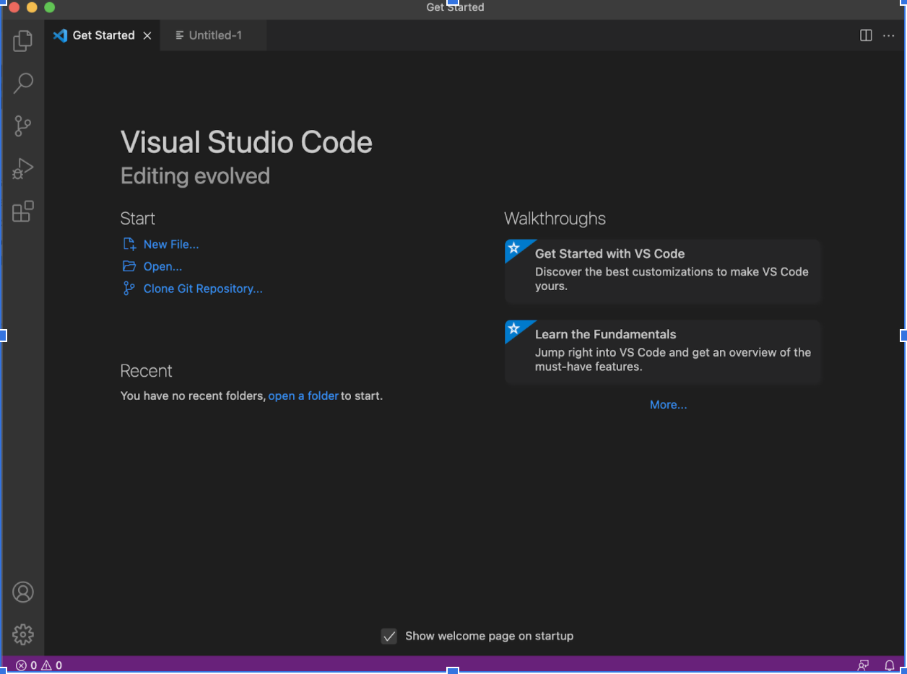
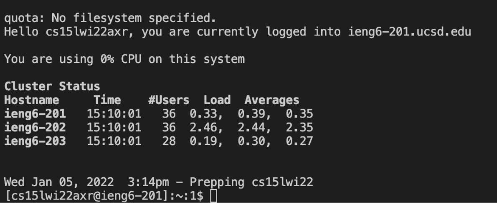
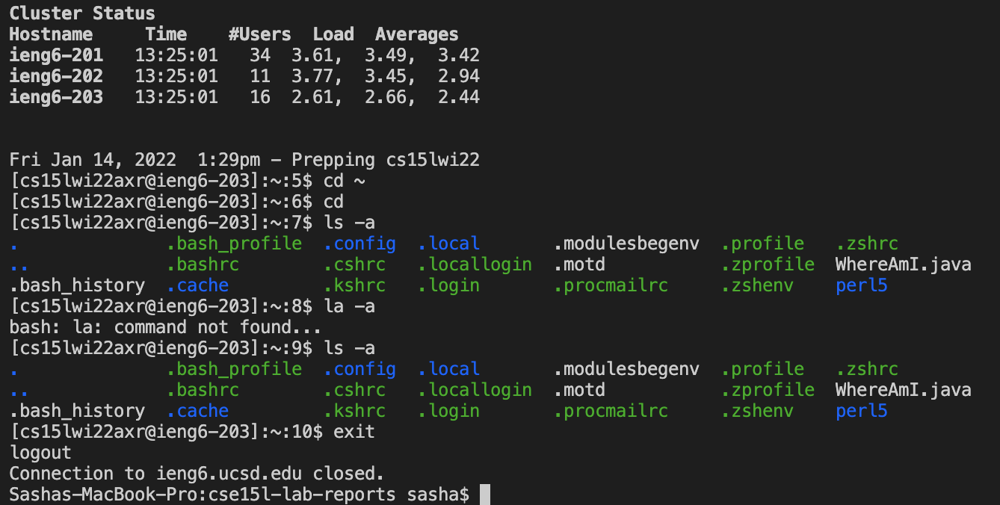
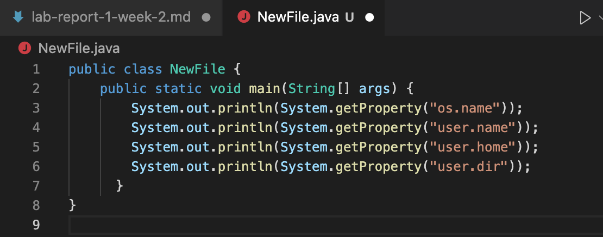
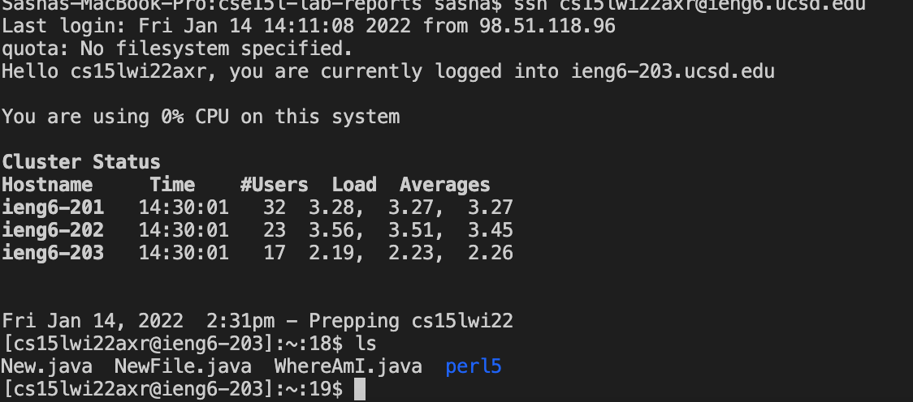
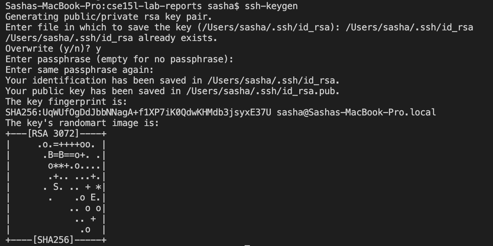
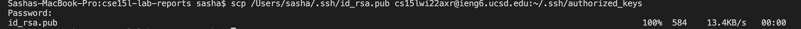
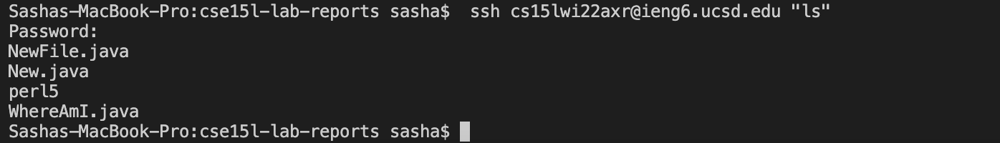

# Welcome to Lab Report

*Today I will present then step-by-step instructions on how to log into a course-specific account on `ieng6`*.
>Step One - Installing VSCode

*Go to the Visual Studio Code website [VSCode](https://code.visualstudio.com/), and follow the instructions to download and install it on your computer. There are versions for all the major operating systems, like OSX (for Macs) and Windows (for PCs). I personally own a Mac, so I did not follow the Windows installation guide.
Upon completion of the step, this is the interface you should be able to see:*

>Step Two - Remotely Connecting

*In order to get connected you need to know your personalized encryption of your account. For you to find that information you should follow the [link](https://sdacs.ucsd.edu/~icc/index.php). Once you log in, make sure to initialize the reset of the password - **might take some time**.
You have to plug in your personalized letters instead of **zzz** as follows:*

*Congrats!*
>Step Three - Trying Some Commands

*For anyone reading my instructions please be mindful of the fact that I go by Sasha as I am Russian, so my computer is Sasha's. Those are my screenshots :) 
The following screenshot presents some of commands that can be tried out by anyone desiring:*

>Step Four - Moving Files with scp

*It is important to be able to go back and fourth between the client (your comoputer) and the remote one.
In order to familirize ourselves with the command that does just that we will first create a file **New.java**:*

*Now I am going to copy the file to the remote server using command scp:*

*Now if we enter the remote server using the old procedure and ask it to list everything that is n there, we will see
the New.java there:*

>Step Five - Setting SSH Key

*Plugging in the password all the time can get tiring, so we can create a SSH key that would be our authentificator.*

*We can make sure we are connected:*

> Step Six - Optimization

*We see the New.java on remote server and the changes are presented to us. Yay!*

How to make remote running more pleasant? Just take a look at the screenshot.

