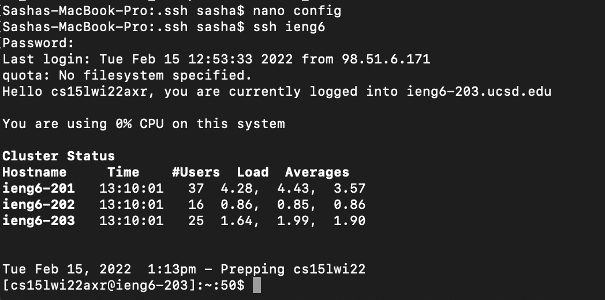

1. Since I am trying to optimize connecting to the remote server, I decided to write down the hostname which is ieng6.ucdf.edu and the user which is unique to my account. After completing this step, I am able to connect to remote server by simply inputting ieng6. I edited it using nano which is a text editor.

2. I logged into the server using only my alias which is ieng6. The screenshot is below.

3. I used scp command to copy the NewFile.java from server onto my computer. Destination: /Users/sasha/Downloads. From: 
/home/linux/ieng6/cs15lwi22/cs15lwi22axr. I recieved this path using pwd command while being logged into the server. 

