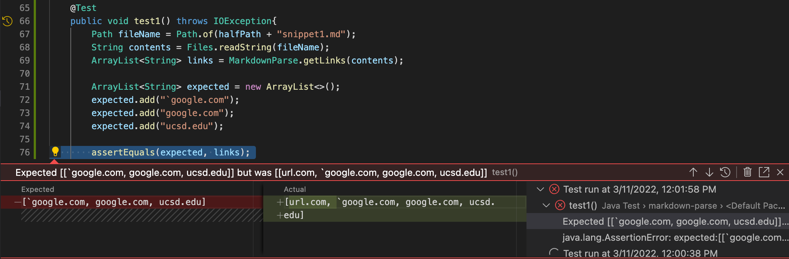
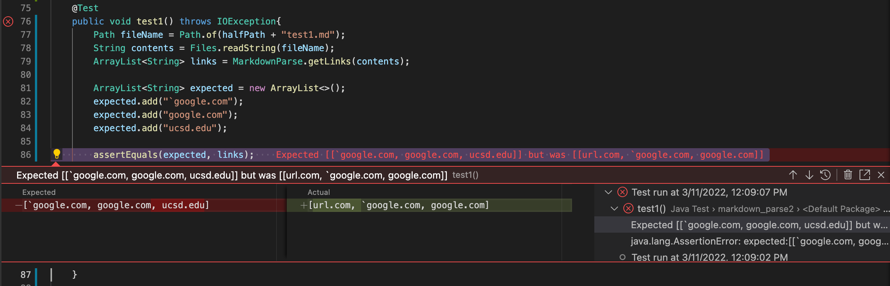
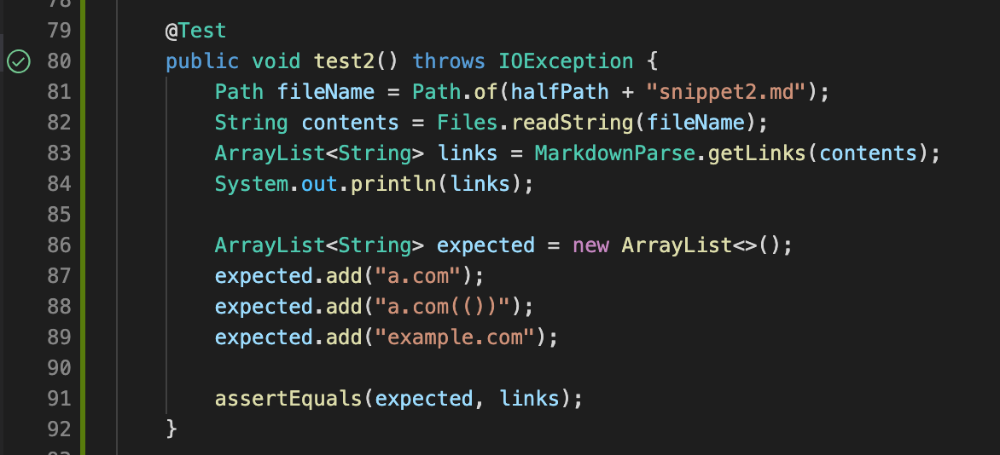
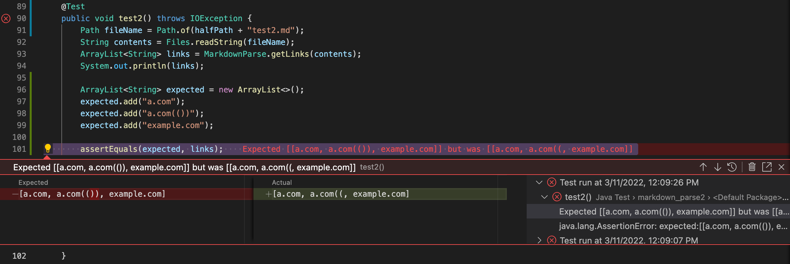
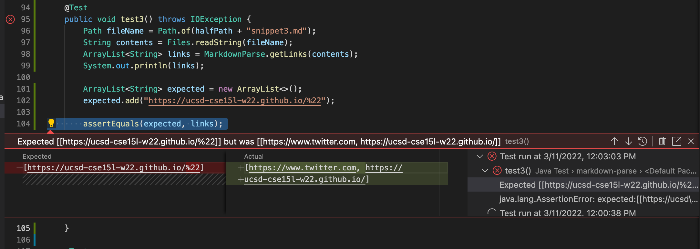
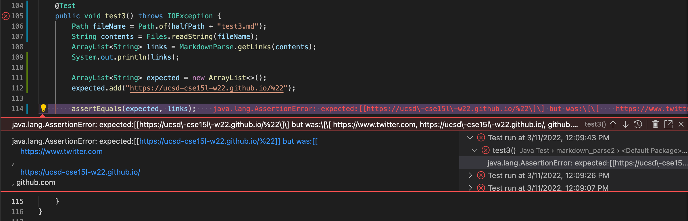

Hello,
Upon the events rolling out in the world and directly affect my family and I, I was not able to complete this lab in time. Could you please clarify which files are classified as 
"reviewed" and which ones are seen as "ours"? I will attempt to complete this lab next week. Please excuse my lack of focus as I am deeply shocked by the events in Russia.

Reviewed Code is from [link](https://github.com/jordan-nishi/markdown-parse). 
My Code is from [link](https://github.com/AleksandraStashkova/markdown_parse2).

**Snippet 1**

Reviewed Code: test 1. 

Expected array included three links which indicated that the test failed.
My Code: test 1.

Test is failed as well. My code has found too many links and read the links that were not meant to be read.

**Snippet 2**
Reviewed Code: test2.

The code of the reviewed group has completed everything successfully.
My Code: test 2.

My code has failed because the code did not follow after the ).

**Snippet 3**
Reviewed Code: test3.

The code has failed because the code is finding links even if the line separates the ().
My Code: test3.

The code reads the entire code without any distinguishers. It just keeps going.

Answers:
1. We could solve the issue by adding the check-point for backtick. The change would probably take less than 10 lines of code.
2. We must add a check-point for not just any ")", but make the code check for a very last one of ")" on a given line. The change would take less than 10 lines of code.
3. We should make a check point which would make sure that the entire link is on one line instead of multiple as well as change up the search engine for the ")". The change would take more than 10 lines of code.