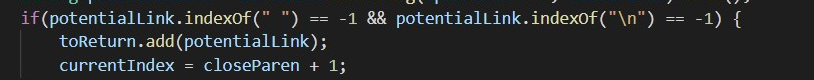

Hello,
Welcome to my Lab Report 5!
*Btw, thanks for the amazing quarter!*

This screenshot depicts the fact that the program outputs not only the links, but also the source of those. That comes in handy as it is easier to compare the outputs in the future. Screenshot above depicts the following process for my group's repository, whilst the screenshot below shows the same process for the cloned repository of Joe Politz. Additionally, I put the result of running the program into the files output2.txt and output1.txt respectively. 

After I put my file output2.txt in the clones repository, I ran the following command to compare the .txt files.

I chose these two outcomes as the errors are quite different. In the first screenshot it seems like the program does not read the links properly. My program is missing the ")". Joe's program is running great.

In this case, my program found everything right, whilst Joe's did not find the link at all.

**How to fix that?**
1. The line search has to be implemented up to the end of the line instead of just the first ")".

2. The program finds the potential link correctly, however it determines whether it is the right link by making sure there is " " or "/n". This could be fixed by adding a checkpoint which makes sure the element is last regardless of the fact whether "/n" is present or not.

Thanks!