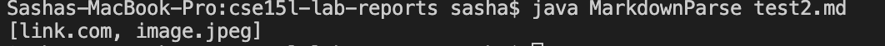
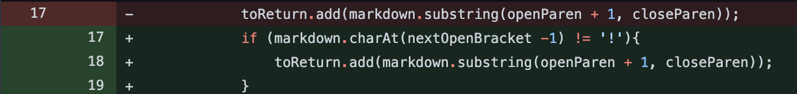
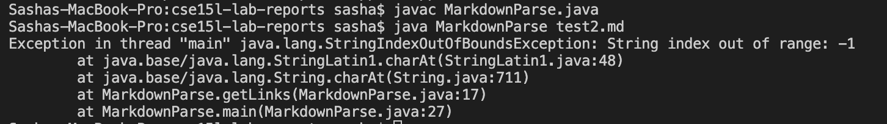
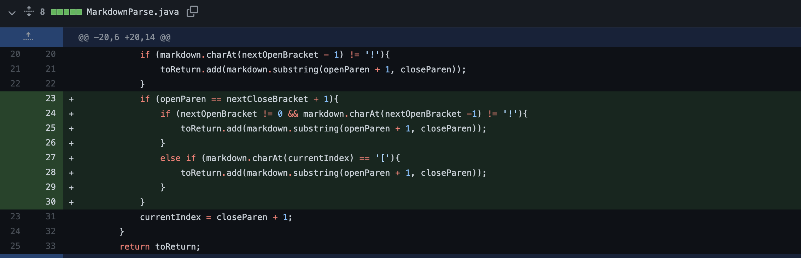
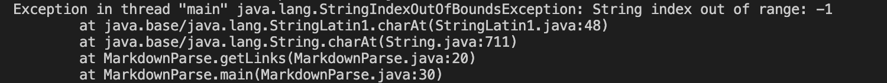
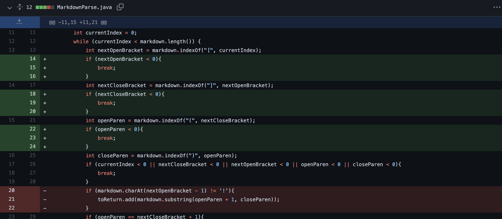

The first change occured when we worked on removing the exclamation mark before the image link. Since the program was looking for the opening bracket first,
we needed to get rid of the exclamation to receive the actual link printed.

**Preface:** unfortunately, thougout the week 3 and 4 I had to jump between two separate lab sessions and in total of 3 TAs. That had resulted in the absence of 
required code changes and surely overall understanding of the material. I decided to start over and re-do the lab assignments on my own. My code changes are: 

> Code Change 1
The first code change will reference the fact that while testing the test2.md file, the program does not realize the difference between the link and the image. The test file is at:
[link](https://github.com/AleksandraStashkova/cse15l-lab-reports/blob/main/test2.md)
The output:

This bug is actually cause by the fact that the program ignored the "!" in the beginning. This is why I am going to implement a following change:
 

 > Code Change 2
 Whilst I thought previous cide change will make the program work, it did not. Thus, I kept on debugging. Current output looks as such:

 

Meamwhile, I hadnoticed that my while loop is actually never going to break. So, I added the if condition which could possibly help me in the future steps. I am still full of hopes that the code will run successfully.

I made the following commit:

This commit is precisely to ignore anything that begins with the exclamation point. 

> Code Change 3

This is still my current output:

In order to figure out what the problem was, I decided to read through the code thoroughly. Since I kept getting the OutOf Bounds exception it only made sense to provide restrictions throughout the code. This is what I mean:

This is making sure that the program would read only the links which begin with [] and not (). this is crucial for the next casesas we would like to check which paranthesis are being used.
Finally, I got the program to only show the link and not the image. 